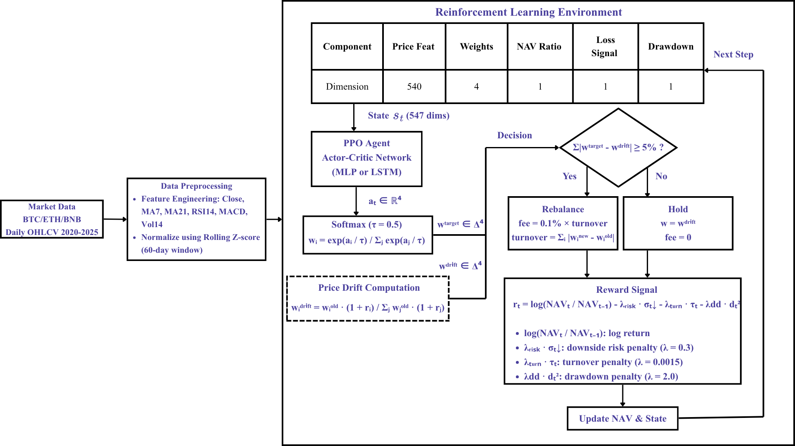
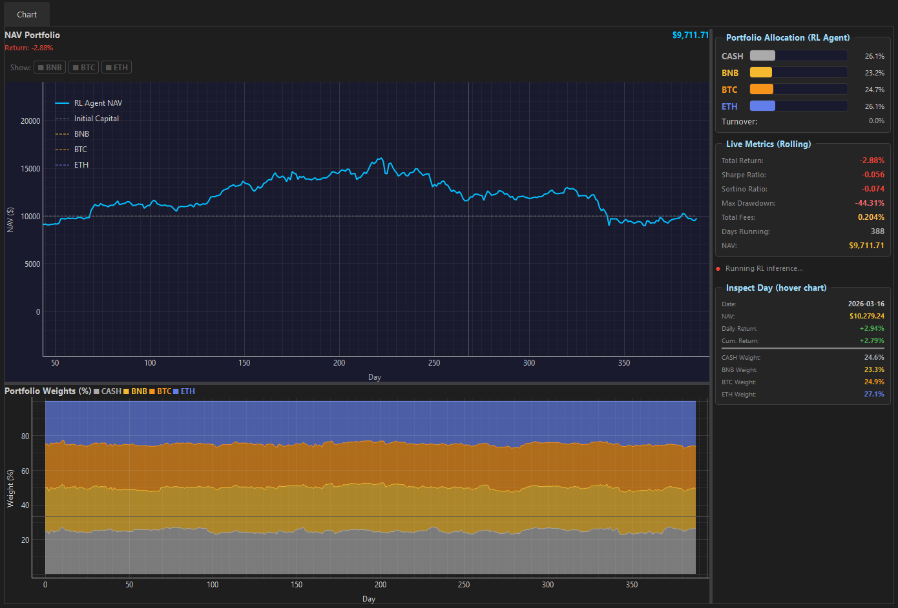
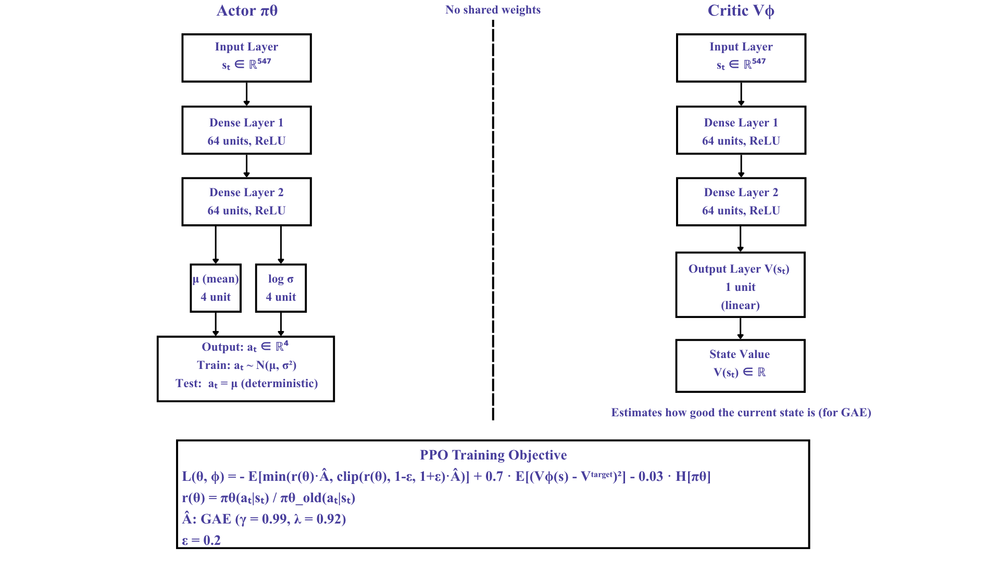

# Deep Reinforcement Learning for Risk-Adjusted Cryptocurrency Portfolio Management

A PPO-based framework for multi-asset crypto portfolio management with **price-drift No-Trade Zone**, **learned cash allocation**, and **quadratic drawdown penalty**. Built with Stable-Baselines3 and Gymnasium.

> Course project for REL301m (Reinforcement Learning) at FPT University -- Spring 2026.



---

## Key Contributions

1. **No-Trade Zone with Price-Drift Comparison** -- Rebalancing decisions compare target weights against *price-drifted* weights (not yesterday's targets), eliminating unnecessary micro-trades. Annual fees drop below 0.6%.
2. **Learned Cash Allocation** -- Cash is modeled as a fourth asset (return = 0). The agent learns *when* to de-risk without hard-coded rules.
3. **Quadratic Drawdown Penalty** -- Drawdown penalty grows as `dd^2`, creating strong non-linear incentive for capital preservation during drawdowns.

---

## Results (avg over 2 walk-forward windows, 3 seeds)

### Experiment 1 -- Reward Function Comparison

| Metric | PPO-Sortino | PPO-Sharpe | PPO-Raw |
|--------|:-----------:|:----------:|:-------:|
| Total Return | 54.3% | 53.7% | 53.6% |
| Sortino Ratio | 1.627 | 1.613 | 1.613 |
| Max Drawdown | 21.95% | 21.99% | 21.97% |
| Trading Freq | 13.3% | 14.5% | 13.8% |
| Total Fees | 0.42% | 0.44% | 0.43% |

> All three reward variants perform similarly -- the No-Trade Zone is the dominant factor.

### Experiment 2 -- PPO vs Baselines

| Metric | PPO-Sortino | Equal-Weight | B&H BTC | MktCap-Weight |
|--------|:-----------:|:------------:|:-------:|:-------------:|
| Total Return | 54.3% | 85.9% | 132.9% | 103.0% |
| Max Drawdown | **21.95%** | 30.8% | 23.1% | 27.3% |
| Sortino Ratio | 1.627 | 1.676 | 2.401 | 1.972 |
| Calmar Ratio | 1.711 | 1.736 | 3.543 | 2.419 |

> PPO achieves the **lowest Max Drawdown** across all strategies. Lower total return is expected: the agent optimizes for risk-adjusted return, not raw return. In bear markets (e.g., 2022 BTC -76.6%), this design is expected to significantly outperform B&H.

### Experiment 3 -- MLP vs LSTM

| Metric | PPO-MLP | PPO-LSTM |
|--------|:-------:|:--------:|
| Total Return | 54.3% | 53.2% |
| Sortino Ratio | 1.627 | 1.655 |
| Max Drawdown | 21.95% | 22.76% |
| Training Time | ~2-3h | ~12h |

> Near-identical performance. MLP is 4x faster to train and recommended for this task.

### Demo Application



---

## Architecture

### Actor-Critic Network



### MDP Flow

```
State (547-dim)
  |-- Market context: 6 features x 3 assets x 30-day lookback = 540
  |-- Portfolio weights: 4 (BTC, ETH, BNB, Cash)
  |-- NAV ratio: 1
  |-- Loss signal: 1 (exponential decay of consecutive losses)
  |-- Drawdown: 1 (current drawdown from peak)

Action: R^4 --> softmax(tau=0.5) --> portfolio weights on simplex

Reward: log(NAV_t / NAV_{t-1})
        - lambda_risk * downside_std          (Sortino-style)
        - lambda_turnover * turnover
        - lambda_dd * drawdown^2              (quadratic)

No-Trade Zone:
  1. Compute drifted weights (what weights become after price change, no trade)
  2. Compare target vs drifted: turnover = sum(|w_target - w_drift|)
  3. If turnover < 5%: HOLD (fee = 0). Else: REBALANCE (fee = 0.1% * turnover)
```

---

## Project Structure

```
.
|-- src/
|   |-- envs/
|   |   |-- MultiAssetPortfolioEnv.py       # Core MDP environment (spot portfolio)
|   |   |-- SingleAssetFuturesEnv_optimize.py  # Extended: single-asset futures env
|   |-- agents/
|   |   |-- train_ppo_portfolio.py          # PPO training (MLP + LSTM)
|   |   |-- train_futures_optimize.py       # Training for futures env
|   |-- evaluation/
|   |   |-- evaluate_portfolio.py           # Metrics: Sharpe, Sortino, MDD, Calmar
|   |   |-- evaluate_futures_optimize.py    # Evaluation for futures env
|   |-- utils/
|       |-- data_utils.py                   # Multi-asset data pipeline
|       |-- data_utils_optimize.py          # Single-asset futures data pipeline
|-- experiments/
|   |-- eda.ipynb                           # Exploratory Data Analysis
|   |-- run_experiments.ipynb               # Exp1 + Exp2 + Exp3 full results
|   |-- grid_search.py                      # Hyperparameter grid search (54 combos)
|   |-- results/                            # Output plots + CSV metrics
|-- models/                                 # Saved model checkpoints (gitignored)
|-- data/                                   # Cached CSV data (gitignored)
|-- docs/                                   # Research papers & reports
|-- requirements.txt                        # Pinned dependencies
```

---

## Setup

```bash
# Clone
git clone https://github.com/<your-username>/DeepRL-PPO-RiskAware-Crypto.git
cd DeepRL-PPO-RiskAware-Crypto

# Virtual environment
python -m venv .venv
source .venv/bin/activate    # Linux/macOS
.venv\Scripts\activate       # Windows

# Install dependencies
pip install -r requirements.txt
```

**Requirements:** Python 3.11+, 8GB+ RAM, internet (first run downloads data from Yahoo Finance).

---

## Usage

```bash
# 1. Verify data pipeline (downloads BTC/ETH/BNB, caches to data/)
python src/utils/data_utils.py

# 2. Train models (3 rewards x 2 windows x 3 seeds = 18 runs, ~2-4h on CPU)
python src/agents/train_ppo_portfolio.py --reward all --window 0 --steps 500000

# Train a specific configuration
python src/agents/train_ppo_portfolio.py --reward sortino_style --window 1 --seed 42

# Train with LSTM policy
python src/agents/train_ppo_portfolio.py --reward sortino_style --lstm

# 3. Hyperparameter grid search (54 combinations)
python experiments/grid_search.py --steps 150000

# 4. Run experiments (in Jupyter)
jupyter notebook experiments/run_experiments.ipynb
```

---

## Walk-Forward Evaluation Protocol

| Window | Train Period | Test Period | Market Regime |
|--------|-------------|-------------|---------------|
| W1 | 2020-01 to 2022-12 | 2023 | Recovery from bear market (BTC +154%) |
| W2 | 2021-01 to 2023-12 | 2024 | Bull run, BTC ETF approval (BTC +111%) |

Final metrics = **average across both test windows** to prevent cherry-picking.

---

## MDP Formulation

| Component | Definition |
|-----------|-----------|
| **State** | Market features (6 x 3 x 30) + portfolio weights (4) + NAV ratio + loss signal + drawdown = 547-dim |
| **Action** | `a in R^4`, transformed via `softmax(a / tau)` to portfolio weights on probability simplex |
| **Reward** | `log_return - 0.3 * downside_std - 0.0015 * turnover - 2.0 * drawdown^2` |
| **Transition** | Daily rebalance with No-Trade Zone (5% threshold) |
| **Fee** | 0.1% per unit of turnover (only when rebalancing) |
| **Episode** | Random start offset, 365 steps |
| **Discount** | gamma = 0.99 |

---

## Technical Indicators (per asset)

| Feature | Description |
|---------|-------------|
| Close | Adjusted close price (rolling z-scored) |
| MA7 | 7-day simple moving average |
| MA21 | 21-day simple moving average |
| RSI(14) | Relative Strength Index |
| MACD | EMA(12) - EMA(26) |
| Volatility(14) | Rolling 14-day return standard deviation |

All features normalized via **rolling z-score** (window=60, no look-ahead).

---

## PPO Hyperparameters (tuned via grid search)

| Parameter | Value | Rationale |
|-----------|-------|-----------|
| Learning rate | 1e-5 | Small LR needed for noisy financial data |
| Gamma | 0.99 | Long-horizon portfolio optimization |
| GAE lambda | 0.92 | Bias-variance tradeoff for advantage estimation |
| Entropy coef | 0.03 | Maintains exploration diversity |
| Clip range | 0.2 | Standard PPO clipping |
| Batch size | 256 | |
| n_steps | 2048 | |

---

## Limitations

- **Bull market bias**: Both test windows (2023, 2024) are bull markets. Bear market evaluation is limited to training data only.
- **Simplified cost model**: Uses flat 0.1% fee; real markets have bid-ask spread, slippage, and market impact.
- **3 assets only**: BTC, ETH, BNB are highly correlated (0.66-0.82). Cash is the only effective hedge.
- **Daily frequency**: Intraday dynamics are not captured.
- **No live trading**: Backtested only; assumes execution at close price.

---

## Future Work

- Single-asset futures trading environment with leverage, funding rates, and CVaR penalty (prototype in `src/envs/SingleAssetFuturesEnv_optimize.py`)
- Deployment as a Hugging Face model for inference
- Attention-based policy network for dynamic feature weighting
- Expanding to more assets (SOL, ADA, etc.) or traditional equities

---

## References

1. Liu et al., "FinRL: A Deep Reinforcement Learning Library for Automated Stock Trading" (2020)
2. Yang et al., "Deep Reinforcement Learning for Automated Stock Trading: An Ensemble Strategy" (2020)
3. Jiang et al., "Deep Reinforcement Learning for Portfolio Management" (2017)
4. Jiang & Liang, "A Deep RL Framework for the Financial Portfolio Management Problem" (2017)
5. Shen & Li, "Risk-Aware Reinforcement Learning Reward for Financial Trading" (2023)
6. Wang et al., "Risk-Aware Deep Reinforcement Learning for Dynamic Portfolio Optimization" (2023)
7. Grossman & Zhou, "On Portfolio Optimization Under Drawdown Constraint" (1993)
8. Sadighian, "Deep RL for Cryptocurrency Trading: Practical Approach to Address Backtest Overfitting" (2020)
9. Lucarelli & Borrotti, "An Ensemble Method of Deep RL for Automated Cryptocurrency Trading" (2020)
10. Fischer, "Reinforcement Learning in Financial Applications: A Survey" (2018)

---

## License

This project is licensed under the MIT License. See [LICENSE](LICENSE) for details.
